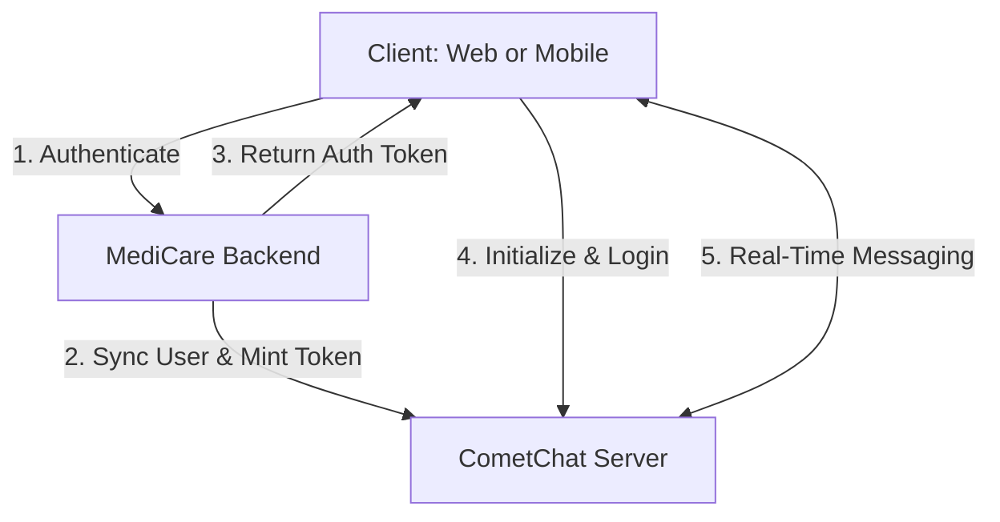

# CometChat Chat Integration & Cross-Platform Messaging

This document details the architecture, configuration, and implementation of the real-time chat messaging system in the MediCare application, ensuring seamless cross-platform communication between the Web client (React) and the Mobile client (React Native / Expo).

---

## 1. Architecture Overview

The MediCare chat system uses **CometChat** as its core messaging engine. The architecture consists of three main parts:

1. **Backend Service Layer**: Manages user synchronization, mints user auth tokens, and gates contact listings based on consultation status.
2. **Web Client (React)**: Renders the desktop/responsive web portal with CometChat UI Kit components.
3. **Mobile Client (React Native / Expo)**: Renders the mobile telehealth application with CometChat React Native UI Kit components.

---

## 2. Aligned UID & Auth Strategy

To support cross-platform communication, both clients must resolve to the same user IDs (UIDs) and authentication sessions.

- **UID Format**: `medicare_user_{USER_ID}` (where `{USER_ID}` is the local PostgreSQL UUID). This ensures deterministic, non-colliding UIDs across both platforms.
- **Client Authentication**:
  - The client logs into the MediCare backend.
  - The client calls `POST /api/cometchat/sync`.
  - The backend syncs the user details (name, role, status, tags) with CometChat and returns a server-minted `authToken`.
  - The client passes this token directly to `CometChatUIKit.loginWithAuthToken(...)`. **Client applications never store or use raw CometChat API Keys.**

---

## 3. Web Chat Implementation

The web chat features are built using `@cometchat/chat-uikit-react@^6.5.2`.

### Provider Setup
[CometChatProvider.jsx](file:///Users/admin/Desktop/project/Medicare/frontend/src/cometchat/CometChatProvider.jsx) handles:
- Config fetch (`GET /api/cometchat/config`).
- UIKit and Calls SDK initialization.
- Reactive logins when user credentials change.
- Gating children render until the connection is ready.

### Chat Screen
[Chats.jsx](file:///Users/admin/Desktop/project/Medicare/frontend/src/pages/Chats.jsx) uses UIKit components for a dual-pane layout:
- Left pane rendering `<CometChatConversations />` for the active conversation history.
- Custom "New Chat" contacts modal listing doctor/patient pairings retrieved via `/api/cometchat/contacts`.
- Right pane rendering `<CometChatMessageHeader />`, `<CometChatMessageList />`, and `<CometChatMessageComposer />`.
- Doctors see group creation options, while patients cannot create groups.

---

## 4. Mobile Chat Implementation

The mobile chat features are built using `@cometchat/chat-uikit-react-native@^5.3.8`.

### Provider Setup
[CometChatContext.js](file:///Users/admin/Desktop/project/Medicare/mobile/src/context/CometChatContext.js) exposes `isReady` status and handles dynamic platform registration, protecting against Expo Go crashes when native modules are unavailable.

### Chat List Screen
[ChatsListScreen.js](file:///Users/admin/Desktop/project/Medicare/mobile/src/screens/ChatsListScreen.js) displays active conversations using CometChat's real-time listeners.

### Chat Simulation Screen
[ChatSimulationScreen.js](file:///Users/admin/Desktop/project/Medicare/mobile/src/screens/ChatSimulationScreen.js) mounts `<CometChatMessageHeader />`, `<CometChatMessageList />`, and `<CometChatMessageComposer />` dynamically based on selected users or groups, with header controls dynamically gated based on user roles.

---

## 5. Telehealth Gating & Contact Constraints

To ensure medical consultation privacy, messaging permissions are strictly gated:
- **Contact Filtering**: `GET /api/cometchat/contacts` only returns patients who have an active, confirmed appointment with the logged-in doctor.
- **Composer Gating**: The message composer displays a locked banner if the consultation is cancelled or pending, preventing unauthorized messaging outside consultation windows.
