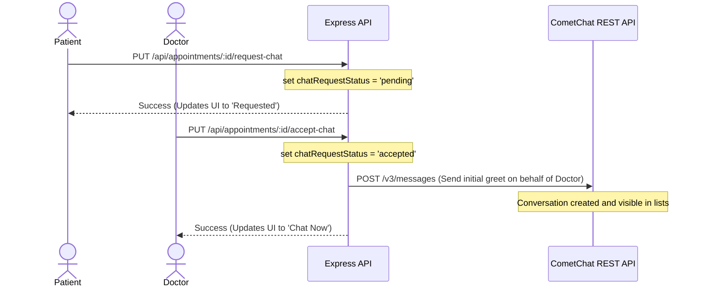

# MediCare Project Knowledge & Architecture Guide

This guide provides a comprehensive overview of the **MediCare** telehealth consultation platform. It details the tech stack, directory structure, database schema, routing flow, and the real-time communication workflow (CometChat & Chat Request Flow) so any developer or agent can understand the project instantly.

---

## 1. Project Overview & Tech Stack

MediCare is a full-stack telehealth portal that facilitates virtual health consultations between Patients and Doctors, assisted by Staff and supervised by Admins.

### Tech Stack
* **Backend**: Node.js, Express, PostgreSQL, Sequelize ORM.
* **Frontend**: React (Vite), Vanilla CSS, custom history-based client-side routing.
* **Mobile**: React Native (Expo), Expo Router, CometChat v5 Native UI Kit.
* **Real-time Messaging & Calling**: CometChat SDK (v4 JS/Native) and UI Kit (v6 React / v5 Native).

---

## 2. Directory Structure

The project is structured as a monorepo:

```text
Medicare/
├── backend/                  # Node/Express API Server
│   ├── config/               # Database connection & init scripts
│   ├── controllers/          # Business logic controllers
│   ├── database/             # Seeder files
│   ├── middleware/           # Token Auth & role validation
│   ├── models/               # Sequelize PostgreSQL models
│   ├── routes/               # API endpoint definitions
│   └── server.js             # Main server entrypoint
├── frontend/                 # React SPA (Vite)
│   ├── public/               # Static assets
│   ├── src/
│   │   ├── components/       # Layouts, navigation, and badges
│   │   ├── context/          # Auth state (JWT) and Toast notification state
│   │   ├── pages/            # Page components (Dashboard, Chats, Appointments, etc.)
│   │   ├── providers/        # CometChatProvider context initialization
│   │   ├── App.jsx           # Custom routing manager & app wrapper
│   │   └── main.jsx          # Entrypoint & global styles
├── mobile/                   # Expo React Native App
│   ├── src/
│   │   ├── context/          # Authentication context
│   │   ├── providers/        # CometChatProvider native context
│   │   ├── screens/          # App screens (Appointments, ChatsList, ChatSimulation)
│   │   └── services/         # API service class (`api.js`)
│   └── App.js                # App providers, navigation & root entry
└── PROJECT_GUIDE.md          # This file
```

---

## 3. Database Schema & Roles

### User Roles
The application defines four distinct user roles:
1. `PATIENT`: Can schedule appointments, upload health records, request chat sessions, and message doctors once accepted.
2. `DOCTOR`: Can review scheduled appointments, view patient health records, initiate/accept chat requests, and make voice/video calls.
3. `STAFF`: Handles scheduling management and support. (Can also act as `AGENT` for support chats).
4. `ADMIN`: Full system access, logs access, and user profile management.

### Principal Models (`backend/models/`)
* **`User`**: Core account information. Contains `cometChatUid` to keep track of the linked CometChat account.
* **`DoctorProfile`**: Extends `User` details for doctors (specialization, bio, experience, availability).
* **`Appointment`**: Connects patients and doctors. Crucial fields include:
  * `status`: `ENUM('confirmed', 'cancelled')`
  * `chatRequestStatus`: `ENUM('none', 'pending', 'accepted')` (tracks the telehealth chat request cycle).
* **`HealthRecord`**: Patient-uploaded PDFs or images.
* **`ActivityLog` & `NotificationLog`**: Logs audit details and records both standard `"app"` notifications and `"cometchat"`-based events.

---

## 4. Custom Client-Side Routing (Web Frontend)

> [!IMPORTANT]
> The web frontend does **NOT** use `react-router-dom`. Avoid installing or importing it.

Routing is managed natively in `frontend/src/App.jsx` using the browser History API:
* **Route State**: Managed via `window.location.pathname` and `window.history.pushState`.
* **Navigation**: Performed using the `navigate(path, state)` function passed down as a prop to child components.
* **Query Parameters**: Must be parsed using the native browser API:
  ```javascript
  const queryParams = new URLSearchParams(window.location.search);
  const targetUid = queryParams.get('uid');
  ```

---

## 5. CometChat Integration & User Sync

### User Sync Workflow
CometChat integration is designed to be completely transparent. Users are synchronized automatically without needing a secondary login step:
1. **Login Sync**: On successful login (`/api/auth/login`), the backend updates or creates the user in CometChat.
2. **Registration Sync**: On user signup, the patient is auto-created in CometChat.
3. **Admin Actions**: When an admin creates a doctor or staff member, they are registered in CometChat immediately.
4. **Auth Token**: The frontend and mobile clients call `/api/profile/cometchat-token` to retrieve a secure session token to login the CometChat SDK.

### SDK Gating & Custom Providers
To prevent skeleton loads or UI kit crashes, CometChat UI components are gated inside `CometChatProvider.jsx` (web) and `CometChatProvider.js` (mobile). The components are only mounted when `isReady` (indicating successful SDK initialization and login) is `true`.

---

## 6. Telehealth Chat Request Workflow

To comply with patient-doctor consultation constraints, direct messaging is gated by a secure chat request flow.



### Flow Breakdown
1. **Requesting Chat (Patient)**:
   * Next to confirmed appointments on `/appointments`, the patient clicks **Request Chat**.
   * Calls `PUT /api/appointments/:id/request-chat`. Status changes to `pending`.
2. **Initiating Chat (Doctor)**:
   * In their appointments panel, the doctor sees **Initiate Chat**.
   * Clicking it calls `PUT /api/appointments/:id/accept-chat`. Status changes to `accepted`.
   * **Establishing the CometChat Conversation**: Because CometChat filters out empty rooms from the inbox list, the backend sends an initial system-style message from the doctor to the patient on accept (`POST https://{appId}.api-{region}.cometchat.io/v3/messages`). This populates the conversation room in the UI for both parties.
3. **Chat Now Gating & Direct Navigation**:
   * Once `accepted`, both see a green **Chat Now** button.
   * **Web Redirect**: Redirects to `/chats?uid=<partnerUid>`. In `Chats.jsx`, the native search parameters are parsed, and if allowed, `CometChat.getUser(uid)` automatically selects and displays the message box.
   * **Mobile Redirect**: Navigates to `Chats` screen passing `{ partnerUid }`. `ChatsListScreen.js` reads this navigation parameter and automatically pushes `ChatSimulationScreen.js` with the corresponding user object.
   * **Security checks**: Both `Chats.jsx` and mobile `ChatsListScreen.js` fetch the appointment list, filter by `accepted`, and reject chat actions for any UID not currently approved.

---

## 7. Configuration Checklist

If you need to configure or verify credentials, ensure your `.env` files contain:

### Backend (`backend/.env`)
```env
PORT=5000
DB_USER=postgres
DB_PASSWORD=your_password
DB_HOST=localhost
DB_PORT=5432
DB_NAME=medicare
JWT_SECRET=your_jwt_secret
COMETCHAT_APP_ID=your_cometchat_app_id
COMETCHAT_REGION=your_cometchat_region
COMETCHAT_REST_API_KEY=your_cometchat_rest_key
```

### Frontend (`frontend/.env`)
```env
VITE_COMETCHAT_APP_ID=your_cometchat_app_id
VITE_COMETCHAT_REGION=your_cometchat_region
VITE_COMETCHAT_AUTH_KEY=your_cometchat_auth_key
```

### Mobile (`mobile/.env`)
```env
EXPO_PUBLIC_COMETCHAT_APP_ID=your_cometchat_app_id
EXPO_PUBLIC_COMETCHAT_REGION=your_cometchat_region
EXPO_PUBLIC_COMETCHAT_AUTH_KEY=your_cometchat_auth_key
```
