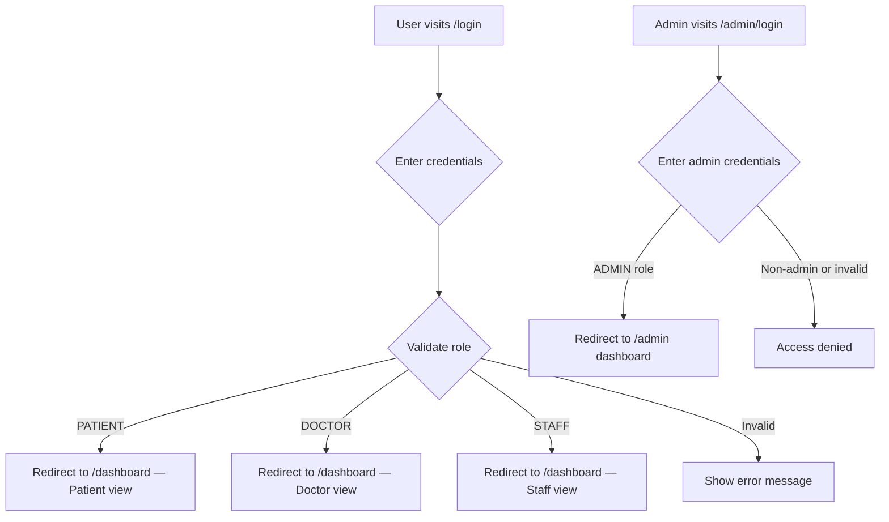
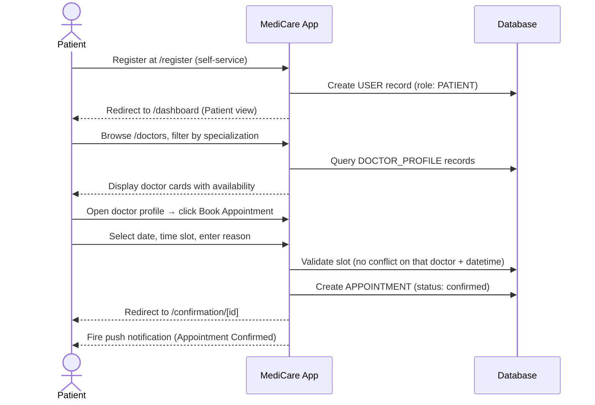
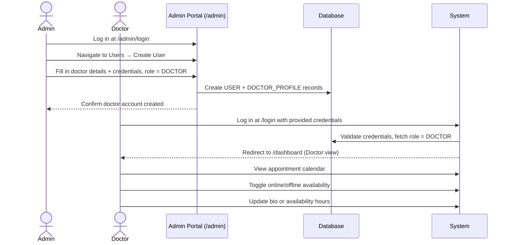
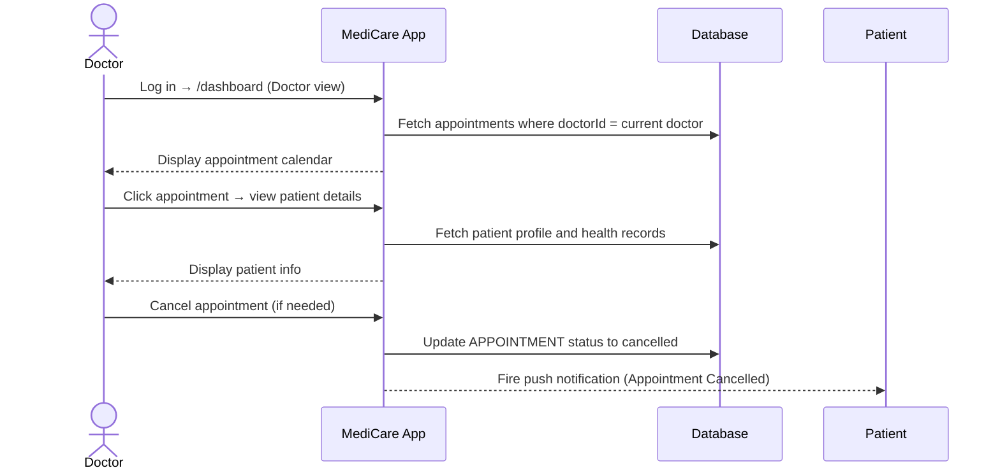
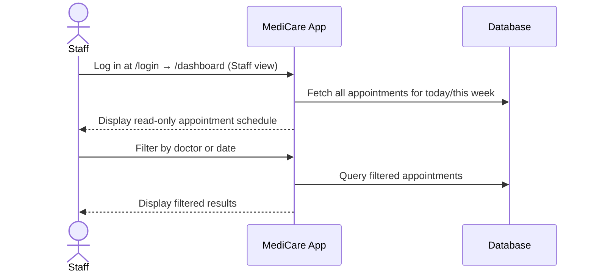
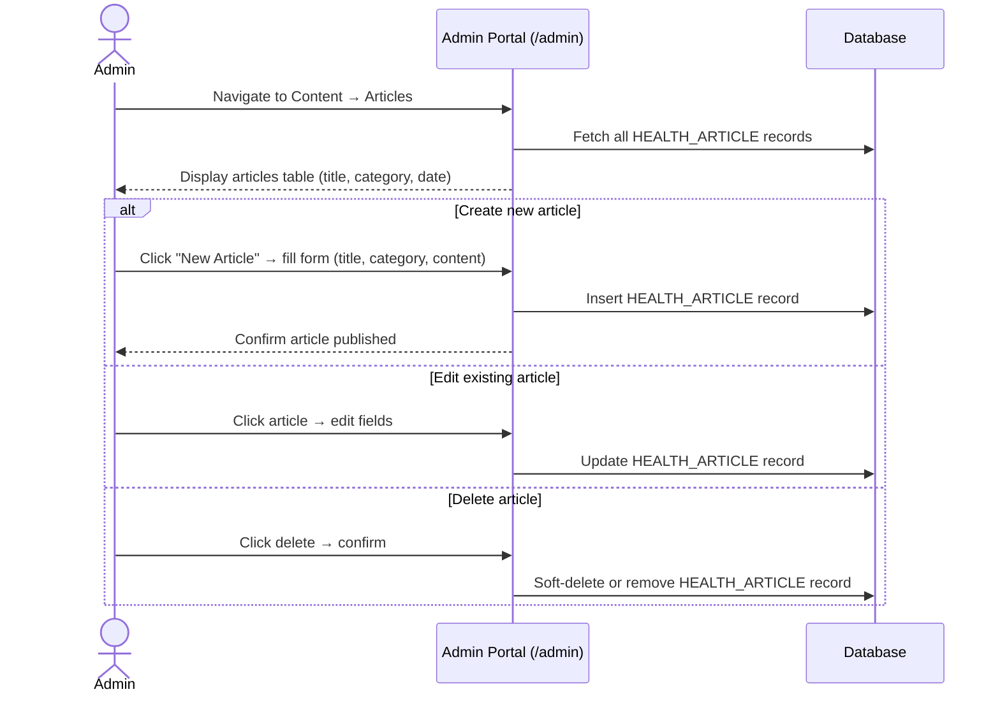
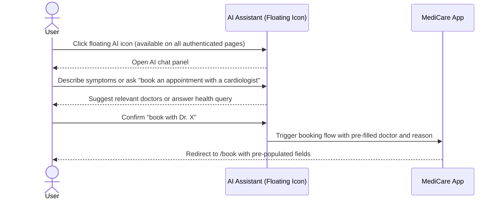
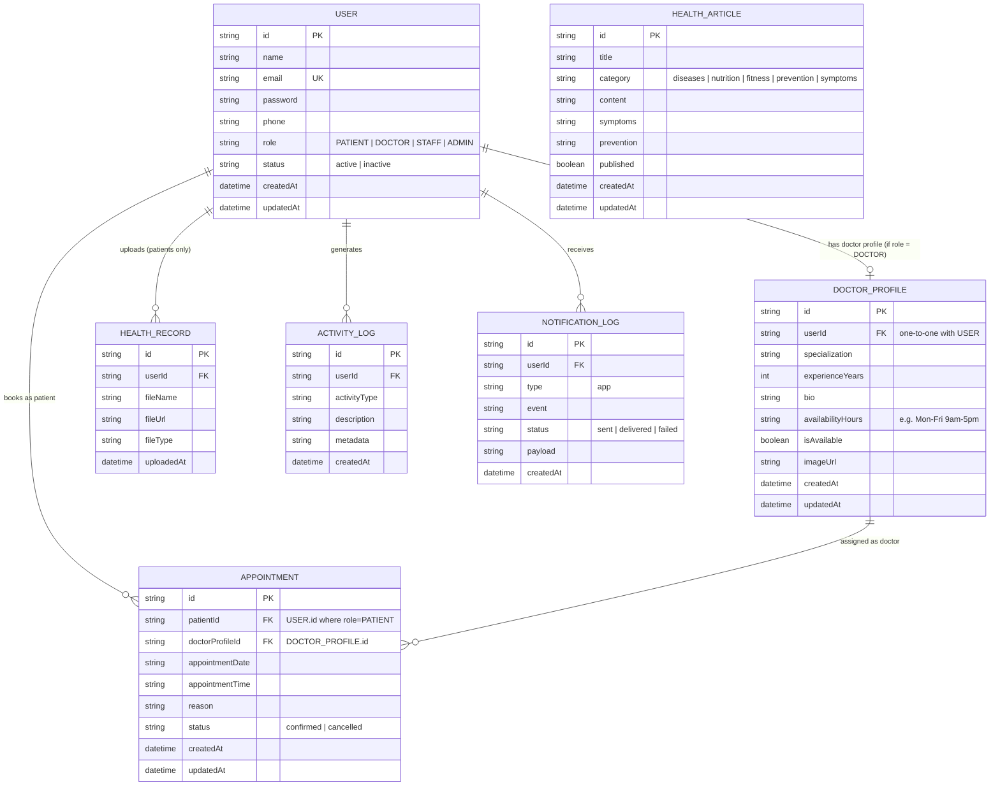

# SCOPE OF WORK — STEP 1
## MediCare: Production-Ready Application

**Document Version:** 1.1  
**Step:** 1 of 2 — Application Build  
**Branch:** `production-ready-app`  
**Status:** Draft — Pending Approval  
**Prepared By:** Development Team  
**Last Updated:** June 2025

> **Note:** This document covers Step 1 only — building the production-ready MediCare application before any real-time communication layer is added. Step 2 (CometChat integration) is covered in a separate document: `SCOPE_OF_WORK_STEP2.md`.

---

## Table of Contents

1. [Application Use Case](#1-application-use-case)
2. [Problem Statement](#2-problem-statement)
3. [Target Users](#3-target-users)
4. [User Roles](#4-user-roles)
5. [User Permissions](#5-user-permissions)
6. [Authentication & Login Model](#6-authentication--login-model)
7. [User Workflows](#7-user-workflows)
8. [Screens & Pages](#8-screens--pages)
9. [Backend APIs](#9-backend-apis)
10. [Database Entities](#10-database-entities)
11. [Notification Flows](#11-notification-flows)
12. [Admin Dashboard Scope](#12-admin-dashboard-scope)
13. [Seed Data Strategy](#13-seed-data-strategy)
14. [Assumptions](#14-assumptions)
15. [Out-of-Scope Items](#15-out-of-scope-items)
16. [Acceptance Criteria](#16-acceptance-criteria)
17. [Testing Plan](#17-testing-plan)
18. [Demo Plan](#18-demo-plan)

---

## 1. Application Use Case

**MediCare** is a comprehensive digital health portal designed to facilitate end-to-end patient-to-doctor consultations, scheduling, and medical education. It serves as a unified virtual clinic where:

- Patients can discover verified medical professionals and explore their credentials and availability
- Patients can book virtual or in-person appointments quickly and without friction
- Doctors can manage their appointment schedule, patient records, and online availability
- Hospital staff can view appointment schedules for coordination purposes
- Users can access a curated library of preventive healthcare and wellness articles
- Patients can interact with an AI assistant for appointment booking and symptom guidance
- Administrators can fully manage all users, content, and system operations through a dedicated admin portal

MediCare is built as a production-ready full-stack application with a clear separation of concerns, scalable architecture, and HIPAA-inspired design principles.

**Key architectural decisions reflected in this scope:**
- There are exactly **three user-facing roles** with distinct login experiences and dashboards: **Patient**, **Doctor**, and **Staff**
- **Doctor profiles are not hardcoded** — they are created and managed by admins through the admin portal, just like any other user
- **Health articles are seeded** with a default dataset but are fully manageable (create, edit, delete) through the admin portal
- The **admin portal is a separate, dedicated interface** at `/admin`, accessible only to users with the `ADMIN` role

---

## 2. Problem Statement

Navigating healthcare services is traditionally disjointed and frustrating for both patients and practitioners. Key pain points include:

- **Scheduling friction:** Patients rely on phone calls and manual scheduling, leading to long wait times and double-bookings.
- **Lack of verified information:** It is difficult for patients to verify doctor specializations, credentials, bios, and real-time availability before committing to a visit.
- **Fragmented medical education:** Reliable, categorized, and accessible health educational content is scattered across multiple platforms with inconsistent quality.
- **No intelligent assistance:** Patients must navigate the entire booking and information flow manually, without the aid of any conversational or AI-driven support.
- **Siloed coordination:** Hospital staff have no unified view of scheduling across their facility; doctors and patients have no shared platform for managing visits.

MediCare addresses these challenges through streamlined appointment booking, a dynamic doctor directory (fully admin-managed, never hardcoded), curated health articles (seeded but admin-editable), an AI-powered assistant, and a robust admin layer — all within a single, production-grade portal.

---

## 3. Target Users

| User Group | Description |
|---|---|
| **Patients** | Individuals seeking medical consultations, appointment booking, and health guidance |
| **Doctors** | Licensed medical professionals whose profiles are created and managed by admins; they log in to manage appointments and patient interactions |
| **Hospital Staff** | Non-clinical hospital employees who log in to view appointment schedules for their facility |
| **Administrators** | System operators who manage all users (including doctor accounts), all content (including articles), roles, and platform operations via the admin portal |

---

## 4. User Roles

| Role | Login? | Dashboard | Description |
|---|---|---|---|
| `PATIENT` | ✅ Yes — `/login` | Patient dashboard | Self-registers; searches doctors, books appointments, manages profile and health records |
| `DOCTOR` | ✅ Yes — `/login` | Doctor dashboard | Account created by admin; logs in to view appointments, manage availability, and access patient records |
| `STAFF` | ✅ Yes — `/login` | Staff dashboard | Account created by admin; logs in to view appointment schedules (read-only) |
| `ADMIN` | ✅ Yes — `/admin/login` | Admin portal | Separate login flow; full platform control including user creation, article management, and system monitoring |

> **Important:** All three non-admin roles (`PATIENT`, `DOCTOR`, `STAFF`) share the same `/login` route but are redirected to their respective dashboards based on their role after authentication. The `ADMIN` role uses a separate login at `/admin/login` to keep the admin portal completely isolated from the main application.

---

## 5. User Permissions

| Role | Permitted Actions |
|---|---|
| **Guest / Anonymous** | Browse the doctors directory, view public doctor bios, read health articles, access the `/login` and `/register` screens |
| **Patient** | All Guest permissions, plus: manage personal profile, upload health records, book appointments, cancel or view scheduled appointments, use the AI assistant |
| **Doctor** | View their assigned appointments, mark themselves online/offline, view connected patient records (if patient has consented), update their own profile bio and availability hours |
| **Staff** | View appointment schedules for their facility (read-only); no ability to create, modify, or cancel appointments |
| **Admin** | Full user management (create, read, update, deactivate any user including doctors and staff), full article management (create, edit, delete health articles), view all activities, notification logs, system summary, search and filter everything |

> **Step 1 Note:** Chat, voice, and video call permissions are intentionally excluded. They are defined in `SCOPE_OF_WORK_STEP2.md`.

---

## 6. Authentication & Login Model

### 6.1 Patient Registration (Self-Service)

Patients are the only role that can self-register. The `/register` page creates a new account with the `PATIENT` role automatically assigned.

### 6.2 Doctor & Staff Account Creation (Admin-Managed)

Doctors and Staff **cannot self-register**. Their accounts are created exclusively by an Admin through the admin portal. When an admin creates a doctor account:

1. Admin fills in the doctor's profile details (name, specialization, experience, bio, availability hours, profile image URL)
2. Admin sets login credentials (email + temporary password)
3. System creates a `USER` record with role `DOCTOR` and a linked `DOCTOR_PROFILE` record
4. Doctor can then log in at `/login` and update their own bio, availability, and presence status

This ensures doctor profiles are **never hardcoded** in the codebase — they are live database records fully managed through the admin portal.

### 6.3 Login Flow

### 6.4 Shared `/dashboard` with Role-Aware Views

The `/dashboard` route is a single page that renders a different layout and menu depending on the authenticated user's role:

- **Patient dashboard:** Appointment history, booking CTA, health records, AI assistant shortcut
- **Doctor dashboard:** Appointment calendar, patient list, online/offline toggle, profile management
- **Staff dashboard:** Read-only appointment schedule view, facility filter

---

## 7. User Workflows

### 7.1 Patient Registration & Booking Workflow

### 7.2 Doctor Account Creation & Login Workflow

### 7.3 Doctor Appointment Management Workflow

### 7.4 Staff Schedule View Workflow

### 7.5 Admin: Article Management Workflow

### 7.6 AI Assistant Workflow

---

## 8. Screens & Pages

### 8.1 Public Screens (Guest Access)

| Screen | Route | Description |
|---|---|---|
| **Home Page** | `/` | Landing page with hero section, specialist shortcut filters, platform feature highlights, stats ribbon, recent health articles preview, and CTAs (Register, Browse Doctors) |
| **Login** | `/login` | Single login form for Patient, Doctor, and Staff; role-aware redirect on success |
| **Registration** | `/register` | Self-service registration for patients only; assigns `PATIENT` role automatically |
| **Doctors Directory** | `/doctors` | Searchable, filterable list of all active doctors (sourced from `DOCTOR_PROFILE` table, not hardcoded); cards show name, specialization, experience, and live availability status |
| **Doctor Details** | `/doctors/[id]` | Full dynamic profile: credentials, bio, specialization, availability hours, and "Book Appointment" CTA — all from the database |
| **Health Articles** | `/articles` | Categorized article library (diseases, nutrition, fitness, prevention, symptoms); seeded initially, admin-managed ongoing |
| **Article Detail** | `/articles/[id]` | Full article content with category badge and related articles sidebar |

### 8.2 Authenticated — Patient Screens

| Screen | Route | Description |
|---|---|---|
| **Patient Dashboard** | `/dashboard` | Appointment summary, upcoming bookings, recent health records, AI assistant shortcut, quick-book CTA |
| **Booking Screen** | `/book` | Calendar date picker, available time slot selector, reason-for-visit textarea, confirm button; can be pre-populated by AI assistant |
| **Booking Confirmation** | `/confirmation/[id]` | Summary: doctor name, specialization, date/time, reason, and next-step CTAs |
| **Appointments** | `/appointments` | Table of all booked appointments with status (confirmed/cancelled), date, time, doctor name, and cancel action |
| **Profile** | `/profile` | Edit personal details (name, email, phone); upload or delete health records |

### 8.3 Authenticated — Doctor Screens

| Screen | Route | Description |
|---|---|---|
| **Doctor Dashboard** | `/dashboard` | Today's appointments, upcoming schedule summary, online/offline toggle, quick links to patient list and profile |
| **Appointments** | `/appointments` | Full appointment calendar view; click into any appointment to view patient details and records |
| **Patient Records** | `/patients/[id]` | View connected patient's profile and uploaded health records (read-only) |
| **Profile** | `/profile` | Edit own bio, update availability hours, update profile image |

### 8.4 Authenticated — Staff Screens

| Screen | Route | Description |
|---|---|---|
| **Staff Dashboard** | `/dashboard` | Read-only today's schedule summary, upcoming appointments count, facility filter |
| **Schedule View** | `/schedule` | Full read-only appointment table filterable by doctor, date range, and status |

### 8.5 Admin Portal Screens (Separate Interface)

| Screen | Route | Description |
|---|---|---|
| **Admin Login** | `/admin/login` | Isolated login form; only `ADMIN` role users can access; redirects to admin dashboard |
| **Admin Dashboard** | `/admin` | System overview: total users by role, total appointments, notification log counts, recent activity feed |
| **User Management** | `/admin/users` | Full user table (all roles); create, edit, deactivate, assign roles; search and filter; create Doctor and Staff accounts here |
| **Create / Edit User** | `/admin/users/new`, `/admin/users/[id]` | Form to create or edit any user; for `DOCTOR` role, includes doctor profile fields (specialization, bio, experience, availability, image) |
| **Article Management** | `/admin/articles` | Full article table; create, edit, publish/unpublish, delete articles; this is the only place articles can be added beyond the seed data |
| **Create / Edit Article** | `/admin/articles/new`, `/admin/articles/[id]` | Rich form: title, category dropdown, content (markdown or rich text), symptoms, prevention tips |
| **Activity Log** | `/admin/activities` | Filterable, paginated log of all user actions across the platform |
| **Notification Log** | `/admin/notifications` | Log of all push notification events with type, recipient, timestamp, and delivery status |

---

## 9. Backend APIs

### 9.1 Authentication

| Method | Endpoint | Access | Description |
|---|---|---|---|
| `POST` | `/api/auth/register` | Public | Creates a new patient; assigns `PATIENT` role; returns session token |
| `POST` | `/api/auth/login` | Public | Validates credentials for Patient, Doctor, or Staff; returns session + role |
| `POST` | `/api/admin/auth/login` | Public | Separate admin login endpoint; validates `ADMIN` role only |
| `POST` | `/api/auth/logout` | Authenticated | Invalidates active session |

### 9.2 Profile

| Method | Endpoint | Access | Description |
|---|---|---|---|
| `GET` | `/api/profile` | Authenticated | Returns current user's profile |
| `PUT` | `/api/profile` | Authenticated | Updates name, phone, bio, password, or availability hours (doctor only) |

### 9.3 Doctors (Dynamic — Database-Driven)

| Method | Endpoint | Access | Description |
|---|---|---|---|
| `GET` | `/api/doctors` | Public | Returns all active doctor profiles from `DOCTOR_PROFILE` table; supports filter by specialization and availability |
| `GET` | `/api/doctors/[id]` | Public | Returns a specific doctor's full profile |

> No doctor data is hardcoded. All records come from the database. Adding a doctor = creating a `DOCTOR` user in the admin portal.

### 9.4 Appointments

| Method | Endpoint | Access | Description |
|---|---|---|---|
| `GET` | `/api/appointments` | Patient, Doctor, Staff | Returns appointments scoped to the current user's role |
| `POST` | `/api/appointments` | Patient | Books a new appointment; validates no slot conflict; triggers push notification |
| `PUT` | `/api/appointments/[id]` | Patient, Doctor | Cancels or updates status; triggers notification to both parties |

### 9.5 Health Records

| Method | Endpoint | Access | Description |
|---|---|---|---|
| `GET` | `/api/records` | Patient | Returns current patient's uploaded health records |
| `POST` | `/api/records` | Patient | Uploads a new health record; triggers push notification |
| `DELETE` | `/api/records/[id]` | Patient | Removes a specific health record |
| `GET` | `/api/records/patient/[id]` | Doctor | Returns health records for a connected patient (doctor access only) |

### 9.6 Health Articles

| Method | Endpoint | Access | Description |
|---|---|---|---|
| `GET` | `/api/articles` | Public | Returns paginated, category-filterable list of published articles |
| `GET` | `/api/articles/[id]` | Public | Returns full article content |

### 9.7 Admin — User Management

| Method | Endpoint | Access | Description |
|---|---|---|---|
| `GET` | `/api/admin/users` | Admin | Returns all users with pagination, search, and role filter |
| `POST` | `/api/admin/users` | Admin | Creates a new user of any role; for `DOCTOR` role, also creates `DOCTOR_PROFILE` record |
| `GET` | `/api/admin/users/[id]` | Admin | Returns a specific user's full details |
| `PUT` | `/api/admin/users/[id]` | Admin | Updates user details, role, or doctor profile fields |
| `DELETE` | `/api/admin/users/[id]` | Admin | Soft-deactivates a user account |

### 9.8 Admin — Article Management

| Method | Endpoint | Access | Description |
|---|---|---|---|
| `GET` | `/api/admin/articles` | Admin | Returns all articles (including unpublished) |
| `POST` | `/api/admin/articles` | Admin | Creates a new health article |
| `PUT` | `/api/admin/articles/[id]` | Admin | Updates article content, category, or published status |
| `DELETE` | `/api/admin/articles/[id]` | Admin | Deletes or archives an article |

### 9.9 Admin — Monitoring

| Method | Endpoint | Access | Description |
|---|---|---|---|
| `GET` | `/api/admin/activities` | Admin | Returns paginated, filterable activity log |
| `GET` | `/api/admin/notifications` | Admin | Returns push notification delivery log |
| `GET` | `/api/admin/summary` | Admin | Returns system-level usage counts (users by role, appointments, notifications sent) |
| `POST` | `/api/admin/seed` | Admin | Triggers database seed (dev/reset only) |

---

## 10. Database Entities

### 10.1 Entity Relationship Diagram

### 10.2 Key Design Notes

- **`USER` and `DOCTOR_PROFILE` are separate tables.** `USER` stores authentication credentials and role. `DOCTOR_PROFILE` stores medical/professional details. This separation means a doctor's professional information can be updated without touching authentication records, and the doctor directory query never needs to join sensitive credential fields.
- **No doctor data is hardcoded anywhere in the application.** The `/doctors` page and `/doctors/[id]` page are entirely driven by `DOCTOR_PROFILE` records in the database. Adding, editing, or removing a doctor is done through the admin portal.
- **`HEALTH_ARTICLE.published` flag** controls visibility on the public `/articles` page. Admins can save draft articles (published = false) before making them live.
- **`USER.status`** uses soft deletion — deactivated accounts are marked `inactive` but not removed from the database, preserving referential integrity for historical appointments and logs.
- All primary keys are UUIDs for security and portability.

---

## 11. Notification Flows

### 11.1 Application Push Notifications

All notifications fire server-side at the point of the triggering API action, before any CometChat integration exists.

| Trigger Event | Recipient(s) | Message |
|---|---|---|
| Appointment booked | Patient + Doctor | "Your appointment on [date] at [time] has been confirmed." |
| Appointment cancelled | Patient + Doctor | "Your appointment on [date] at [time] has been cancelled." |
| New health record uploaded | Patient | "Your health record '[filename]' was uploaded successfully." |
| Admin announcement sent | Targeted role or all users | Custom message body composed by admin |
| User account deactivated | Affected user | "Your account has been deactivated. Please contact support." |
| New article published | All users (optional) | "New article: '[title]' is now available in the Health Library." |

All events are written to `NOTIFICATION_LOG` with delivery status before the push is attempted.

### 11.2 In-App Toast Notifications

If a user is on any page other than the directly relevant one when an event fires (e.g., browsing articles when an appointment is cancelled), a toast notification appears in the top-right corner with the event message and a navigation link.

### 11.3 Notification Architecture

- Notifications are triggered server-side inside the relevant API handler.
- Each event is first persisted to `NOTIFICATION_LOG`, then the Web Push API delivery is attempted using VAPID keys from environment config.
- Delivery status (`sent` / `delivered` / `failed`) is updated after the push call resolves.
- The admin portal surfaces the full log at `/admin/notifications`.

---

## 12. Admin Dashboard Scope

The admin portal (`/admin`) is a **fully separate interface** from the main application. It has its own login page, its own navigation, and its own layout. Regular users (patients, doctors, staff) are never exposed to admin routes.

### 12.1 User Management (including Doctor & Staff Account Creation)

- View all users in a searchable, role-filterable, paginated table
- **Create Doctor accounts:** form includes all `DOCTOR_PROFILE` fields (specialization, experience, bio, availability, image URL) plus login credentials
- **Create Staff accounts:** form includes basic user fields plus facility assignment
- **Create Patient accounts:** admin can manually create patients if needed
- Edit any user's details, role, or linked doctor profile
- Deactivate user accounts (soft delete)
- View per-user activity history

### 12.2 Article Management

- View all articles (including drafts) in a searchable, category-filterable table
- **Create new articles** with: title, category, full content (markdown supported), symptoms section, prevention tips section, and published/draft toggle
- **Edit any existing article** — title, content, category, or publish status
- **Delete articles** (soft delete / archive)
- Toggle an article between published (visible on `/articles`) and draft (hidden from public)

> The seed data provides an initial set of articles across all categories. After seeding, the admin portal is the **only** way to add, edit, or remove articles. There are no hardcoded articles in the codebase.

### 12.3 Activity & Notification Monitoring

- Filterable, paginated activity log: all user actions (bookings, cancellations, uploads, logins, profile updates)
- Push notification log: all notification events with recipient, type, status, and timestamp

### 12.4 System Summary Panel

- Total users by role (Patient / Doctor / Staff / Admin)
- Total appointments (confirmed vs. cancelled)
- Total articles (published vs. draft)
- Total push notifications (sent vs. failed)

### 12.5 Database Seeding & Reset (Development Only)

- `npm run seed` — Populates with 100+ realistic users, doctor profiles, health articles (across all categories), and sample appointments
- `npm run db:reset` — Clears all records and re-runs migrations for a clean test environment

---

## 13. Seed Data Strategy

The seed script (`database/seeders/`) must produce realistic data suitable for demos, testing, and the subsequent CometChat integration.

### 13.1 Seeded Users

| Role | Count | Notes |
|---|---|---|
| `ADMIN` | 2 | `admin@medicare.com` (primary), `superadmin@medicare.com` |
| `DOCTOR` | 30+ | Varied specializations (cardiology, neurology, dermatology, orthopedics, pediatrics, general medicine, etc.); each has a complete `DOCTOR_PROFILE` with bio, availability, and image |
| `STAFF` | 15+ | Varied facility assignments |
| `PATIENT` | 55+ | Varied profiles; each has at least one past appointment and one uploaded health record |

Total: 100+ users minimum.

### 13.2 Seeded Appointments

- At least 60 appointments across multiple doctors and patients
- Mix of `confirmed` and `cancelled` statuses
- Spread across past, present, and future dates

### 13.3 Seeded Articles

- At least 15 articles covering all 5 categories: diseases, nutrition, fitness, prevention, symptoms
- Mix of `published` (visible on `/articles`) and `draft` (admin-only) articles
- Realistic medical content (not lorem ipsum)

### 13.4 Login Credentials for Testing

All seed users have predictable credentials for demo purposes:

| Role | Email Pattern | Password |
|---|---|---|
| Admin | `admin@medicare.com` | `Admin@1234` |
| Doctor | `doctor.{specialty}@medicare.com` | `Doctor@1234` |
| Staff | `staff.{n}@medicare.com` | `Staff@1234` |
| Patient | `patient.{n}@medicare.com` | `Patient@1234` |

---

## 14. Assumptions

1. Users have active internet connections and modern browsers supporting `localStorage`, `Notification`, and `WebSocket` APIs.
2. The application is desktop-first with a responsive layout for tablets and mobile.
3. **Doctor profiles are never hardcoded.** All doctor data lives in the database. The only way to add a doctor to the platform is via the admin portal.
4. **Health articles are seeded initially but are exclusively managed via the admin portal** after deployment. No articles exist in the codebase; they are all database records.
5. Health records uploaded by patients are stored on the local filesystem in development (`/uploads`). Cloud storage (e.g., S3) is production-ready but out of scope for this implementation.
6. AI assistant responses are powered by a third-party LLM API (e.g., Anthropic Claude API). Medical accuracy guardrails are handled via system prompts at the API layer.
7. All displayed times are in the user's local browser timezone.
8. The admin portal is completely separate from the main application; there are no shared layout components or routes between `/admin/*` and the rest of the app.

---

## 15. Out-of-Scope Items

The following are explicitly excluded from Step 1:

- **Real-time chat, voice calls, or video calls** — all deferred to Step 2 (CometChat integration)
- **CometChat SDK or API usage of any kind** — Step 1 represents the pre-CometChat application
- **Encrypted patient health records at the application layer** — encryption at rest is a hosting/platform concern
- **Third-party billing or payment integration** (e.g., Stripe)
- **EMR / EHR integration** with external hospital systems (e.g., Epic, Cerner)
- **Prescription management or e-prescription generation**
- **SMS or email notification delivery** — Web Push API only
- **Doctor self-registration** — doctors are admin-created only
- **Multi-language or internationalization (i18n) support**
- **Mobile native app** — web-based responsive application only

---

## 16. Acceptance Criteria

Step 1 is considered complete only when all criteria below are met:

| Criterion | Status |
|---|---|
| Production-ready app is functional end-to-end | ☐ |
| Frontend is fully implemented with all defined screens | ☐ |
| Backend is fully implemented with all defined APIs | ☐ |
| Admin portal is implemented as a fully separate interface at `/admin` | ☐ |
| Admin login at `/admin/login` works and is isolated from the main login | ☐ |
| Patient self-registration works; Doctor and Staff accounts are admin-created only | ☐ |
| All three roles (Patient, Doctor, Staff) have distinct dashboards after login | ☐ |
| Role-based redirects work correctly on login | ☐ |
| Role-based access control is enforced at both API and UI levels | ☐ |
| **No doctor data is hardcoded** — all doctor records come from the database | ☐ |
| Admin can create, edit, and deactivate Doctor and Staff accounts through the admin portal | ☐ |
| **No article data is hardcoded** — seed script populates articles; admin portal manages them | ☐ |
| Admin can create, edit, publish/draft, and delete health articles through the admin portal | ☐ |
| 100+ users seeded with varied roles, profiles, and activity history | ☐ |
| Seeded articles cover all 5 categories with a mix of published and draft statuses | ☐ |
| Push notifications trigger for all defined application events | ☐ |
| Notification events are persisted to the notification log | ☐ |
| Admin can view user activity logs and notification logs | ☐ |
| Code is committed to the `production-ready-app` branch | ☐ |
| `SCOPE_OF_WORK_STEP1.md` is prepared and approved | ☐ |
| `DECISION_LOG.md` documents alternates and reasoning for all Step 1 decisions | ☐ |

---

## 17. Testing Plan

| Area | What is Tested |
|---|---|
| **Full-Stack Architecture** | Clean separation of frontend, backend, database; modular folder structure; no business logic in components |
| **Code Quality** | Consistent naming conventions; no dead code; readable, maintainable structure |
| **Production Readiness** | Error handling, loading states, empty states, input validation, server-side logging |
| **Security Awareness** | bcrypt password hashing; authenticated API access; role-guarded endpoints; admin routes completely inaccessible to non-admins; environment-based secrets |
| **Role & Permission Design** | Patient, Doctor, and Staff see correct dashboards and menus; unauthorized API requests return 401/403 |
| **No Hardcoded Doctor Data** | Removing all doctor records from the database causes the `/doctors` page to show an empty state, not a hardcoded list |
| **No Hardcoded Article Data** | Removing all articles from the database causes `/articles` to show an empty state, not hardcoded content |
| **Admin Portal Isolation** | Non-admin users cannot access any `/admin/*` route; attempting returns 403 |
| **Admin Article Management** | Create, edit, publish/draft, and delete all work correctly; published status controls visibility on `/articles` |
| **Admin User Management** | Creating a DOCTOR user creates both `USER` and `DOCTOR_PROFILE` records; doctor appears in `/doctors` immediately |
| **Database Design** | Normalized schema; correct entity relationships; no N+1 queries; UUID primary keys |
| **API Design** | RESTful conventions; consistent error shapes; correct HTTP status codes |
| **Push Notifications** | Notifications fire for all trigger events; logged with correct delivery status |
| **Seed Data Quality** | 100+ users; realistic profiles; all roles represented; article categories covered |
| **Documentation Quality** | All required Step 1 documents complete and accurate |
| **Decision-Making Quality** | Decision log includes genuine alternate options and honest trade-off analysis |
| **Git Hygiene** | Clean descriptive commit history; all work in `production-ready-app` branch |

---

## 18. Demo Plan

The Step 1 demo demonstrates the application as a complete, production-grade system before any real-time communication is added.

1. **Admin Login** — Log in at `/admin/login` with `admin@medicare.com`; confirm redirect to admin portal (separate interface).
2. **View Seeded Users** — Navigate to User Management; show 100+ users filtered by each role.
3. **Create a Doctor Account** — Admin creates a new doctor (name, specialization, bio, availability, credentials); confirm `DOCTOR_PROFILE` is created.
4. **Doctor Appears in Directory** — Open a guest browser; navigate to `/doctors`; confirm the newly created doctor appears immediately — proving no hardcoding.
5. **Create a Staff Account** — Admin creates a new staff user with role `STAFF`.
6. **Manage Articles** — Navigate to Article Management; show existing seeded articles; create a new article (fill title, category, content, publish); confirm it appears on `/articles`.
7. **Edit & Draft an Article** — Edit an existing article, toggle it to draft; confirm it disappears from the public `/articles` page.
8. **View Activity & Notification Logs** — Admin reviews activity log and notification log with existing seeded data.
9. **Patient Login** — Log in as a patient at `/login`; confirm redirect to patient dashboard (not admin).
10. **Search Doctors** — Patient filters the `/doctors` directory by specialization; opens a doctor profile.
11. **Book Appointment** — Patient books an appointment; push notification fires; booking appears in appointments table.
12. **AI Assistant** — Patient opens the floating AI assistant; types a symptom query; AI suggests a doctor; patient books via the assistant.
13. **Upload Health Record** — Patient uploads a health record from `/profile`; push notification fires.
14. **Doctor Login** — Log in as a doctor at `/login`; confirm redirect to doctor dashboard.
15. **Doctor Views Appointments** — Doctor sees their assigned appointments and opens a patient's record.
16. **Staff Login** — Log in as a staff user; confirm read-only schedule view with no booking or cancellation controls.
17. **Appointment Cancellation** — Doctor or patient cancels an appointment; push notification fires for both parties; admin notification log updated.
18. **Decision Walkthrough** — Developer walks through 3–5 key Step 1 decisions from `DECISION_LOG.md`.

---

*This document covers Step 1 only. Upon approval and successful completion of Step 1, the team will proceed to `SCOPE_OF_WORK_STEP2.md`.*

*Implementation must not begin until this document is reviewed and formally approved.*
