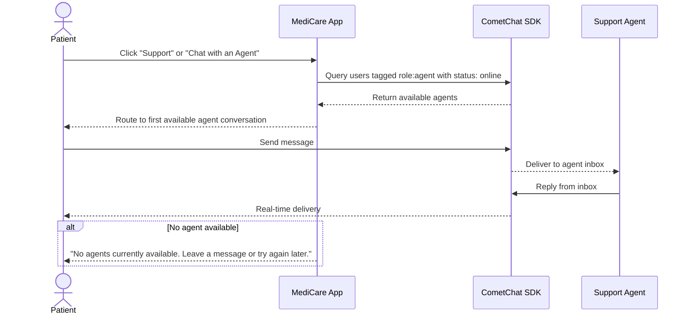
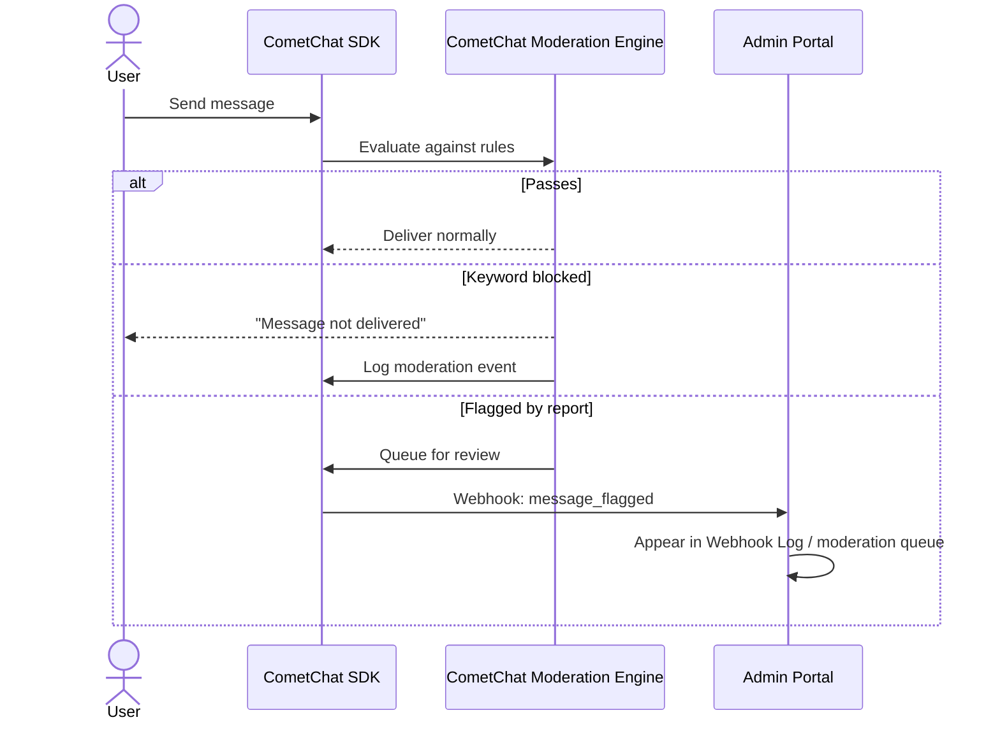
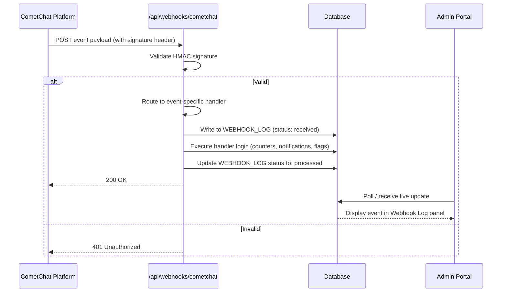

# SCOPE OF WORK — STEP 2
## MediCare: CometChat Real-Time Communication Integration

**Document Version:** 1.2  
**Step:** 2 of 2 — CometChat Integration  
**Branch:** `cometchat-integration` (from `production-ready-app`)  
**Status:** Draft — Pending Approval  
**Prepared By:** Development Team  
**Last Updated:** June 2026

> **Prerequisite:** Step 1 (`SCOPE_OF_WORK_STEP1.md`) must be fully approved and the `production-ready-app` branch must be complete and frozen before any work in this document begins.

> **Guiding Principle:** CometChat is being integrated into an existing production system. Every change is strictly additive. No existing API, workflow, screen, role logic, notification pipeline, or admin portal feature is removed or broken.

---

## Table of Contents

1. [Integration Overview](#1-integration-overview)
2. [Branch Strategy](#2-branch-strategy)
3. [User Sync with CometChat](#3-user-sync-with-cometchat)
4. [Role & Tag Mapping](#4-role--tag-mapping)
5. [Real-Time Communication Features](#5-real-time-communication-features)
6. [Chat Interface](#6-chat-interface)
7. [Push Notifications — Updated Scope](#7-push-notifications--updated-scope)
8. [Agent Chat](#8-agent-chat)
9. [Moderation](#9-moderation)
10. [CometChat Webhooks](#10-cometchat-webhooks)
11. [Database Changes](#11-database-changes)
12. [New & Updated Backend APIs](#12-new--updated-backend-apis)
13. [Admin Portal — Updated Scope](#13-admin-portal--updated-scope)
14. [CometChat Skills Usage](#14-cometchat-skills-usage)
15. [Assumptions](#15-assumptions)
16. [Out-of-Scope Items](#16-out-of-scope-items)
17. [Acceptance Criteria](#17-acceptance-criteria)
18. [Testing Plan](#18-testing-plan)
19. [Demo Plan](#19-demo-plan)

---

## 1. Integration Overview

In Step 2, CometChat is integrated into the MediCare platform to add secure, real-time communication. This includes one-on-one messaging, group messaging, voice and video calling, agent-based support chat, content moderation, and webhook-driven activity logging.

### What Changes vs. Step 1

| Area | Step 1 State | Step 2 Change |
|---|---|---|
| Chat | Not present | Full CometChat chat interface added at `/chat` |
| Calling | Not present | Voice/video calling added to chat (doctor-initiated only) |
| User identity | App-only | `cometChatUid` field added to `USER` table; auto-synced on login |
| Doctor accounts | Admin-created, no CometChat | On login, doctor accounts are synced to CometChat with `doctor` role and department tags |
| Staff accounts | Admin-created, no CometChat | Synced with restricted `staff` CometChat role; no messaging access |
| Push notifications | App events only | CometChat message/call notifications added alongside existing app notifications |
| Admin portal | User mgmt + article mgmt + logs | Webhook log panel added; notification log updated to show CometChat events |
| Database | No `cometChatUid`, no webhook log | `cometChatUid` on `USER`; new `WEBHOOK_LOG` table |

### What Does Not Change

- Patient self-registration flow is unchanged
- Doctor and Staff account creation via admin portal is unchanged
- Article management via admin portal is unchanged
- All Step 1 APIs continue to function identically
- All Step 1 push notifications continue to fire unchanged
- The three-role login model and dashboard redirects are unchanged
- No hardcoding of doctors or articles is introduced

---

## 2. Branch Strategy

```
main
└── production-ready-app          ← Step 1 complete; FROZEN after Step 1 approval
    └── cometchat-integration     ← All Step 2 work in this branch only
```

The `production-ready-app` branch must not receive any commits after Step 1 approval. It is a clean, verifiable snapshot of the pre-CometChat application.

---

## 3. User Sync with CometChat

### 3.1 Strategy

All three user roles (Patient, Doctor, Staff) are synced with CometChat transparently on login. No separate CometChat login step is presented to the user.

| Scenario | Handling |
|---|---|
| **Existing seeded patients** | Synced on first login post-Step 2 deployment; CometChat user created via REST API; `cometChatUid` stored |
| **Existing seeded doctors** | Same — synced on first login; also tagged by specialization department |
| **Existing seeded staff** | Synced with restricted `staff` CometChat role |
| **Newly registered patients** | `POST /api/auth/register` creates CometChat user immediately; `cometChatUid` stored before response returns |
| **Admin-created doctor accounts** | `POST /api/admin/users` creates CometChat user at the time of account creation; doctor is CometChat-ready before their first login |
| **Admin-created staff accounts** | Same — CometChat user created at account creation time |
| **Profile updates** | `PUT /api/profile` syncs updated name/display info to CometChat |
| **Account deactivation** | `DELETE /api/admin/users/[id]` deactivates the CometChat user via REST API |

### 3.2 UID Strategy

- `cometChatUid` is deterministically derived from the app's `USER.id` (e.g., `medicare_user_{id}`)
- Stored in `USER.cometChatUid` after first successful sync
- The client SDK is initialized using an auth token from `/api/cometchat/sync` — never with raw API keys

### 3.3 Sync Workflow

```mermaid
sequenceDiagram
    actor User
    participant App as MediCare App
    participant SyncAPI as /api/cometchat/sync
    participant CometChat as CometChat REST API
    participant DB as Database

    User->>App: Login (any role)
    App->>SyncAPI: POST /api/cometchat/sync (with session token)
    SyncAPI->>CometChat: Create or update CometChat user + assign role + tags
    CometChat-->>SyncAPI: Return CometChat UID + Auth Token
    SyncAPI->>DB: Store cometChatUid on USER record (if not already set)
    SyncAPI-->>App: Return auth token to client
    App->>App: Initialize CometChat SDK with auth token
    App-->>User: CometChat active; chat icon visible in nav
```

---

## 4. Role & Tag Mapping

### 4.1 CometChat Role Mapping

| App Role | CometChat Role | Messaging Access | Calling Access |
|---|---|---|---|
| `PATIENT` | `patient` | Can send/receive messages to connected doctors | Can receive and accept calls; cannot initiate |
| `DOCTOR` | `doctor` | Can send/receive messages to connected patients and peers | Can initiate and accept calls |
| `STAFF` | `staff` | No messaging; presence only | No calling |
| `ADMIN` | `admin` | Full access for moderation and support | Full access |

### 4.2 CometChat Tag Mapping

| Tag | Applied To | Purpose |
|---|---|---|
| `role:patient` | All patients | Contact filtering; webhook routing |
| `role:doctor` | All doctors | Contact filtering; call permission enforcement |
| `role:staff` | All staff | Messaging restriction enforcement |
| `role:admin` | All admins | Moderation escalation routing |
| `role:agent` | Staff sub-type (support agents) | Agent availability routing; inbox filtering |
| `dept:cardiology`, `dept:neurology`, etc. | Doctors | Tagged by specialization at account creation; used for group management and agent routing |
| `verified` | All synced app users | Distinguishes live app users from any CometChat test accounts |
| `type:care-team` | Groups | Identifies care team groups for doctor queries |
| `type:department` | Groups | Identifies department-wide channel groups |
| `type:support` | Groups | Identifies patient support conversation groups |
| `priority:urgent` | Messages | High-visibility messages (renders with indicator) |
| `priority:follow-up` | Messages | Doctor-marked messages requiring follow-up |
| `moderation:flagged` | Messages | Content flagged for admin review |
| `pinned` | Conversations | User-pinned conversations (sorted to top) |
| `archived` | Conversations | User-archived conversations |
| `needs-follow-up` | Conversations | Doctor-marked conversations requiring follow-up |

### 4.4 Tag Use Cases

#### T1 — Role-Based Contact Filtering

Patients opening `/chat` see only doctors; doctors see patients and peer doctors. The SDK filters contacts at query time using `UsersRequestBuilder().setTags(["role:doctor"])` (patient view) or `setTags(["role:patient"])` (doctor view). No custom backend logic is needed for each query — the tag system handles it natively.

#### T2 — Department-Based Doctor Discovery

Patients searching for a specialist or agents escalating a query filter by department tag:
- Patient searches cardiologists: `UsersRequestBuilder().setTags(["dept:cardiology"])`
- Agent escalates to specialist: filter `dept:cardiology` + `status:online`
- Admin views doctor distribution by department tag counts

#### T3 — Agent Availability & Routing

When a patient clicks "Chat with an Agent," the system queries:
- `UsersRequestBuilder().setTags(["role:agent"]).setStatus("online")`
- Returns only online agents → route to first available
- Empty result → "No agents currently available" fallback
- Future extensibility: skill-based routing via `["role:agent", "skill:billing"]`

#### T4 — Group Organization by Purpose

Groups are tagged by purpose for filtered views:
- Doctor views care teams: `GroupsRequestBuilder().setTags(["type:care-team"])`
- Department announcements: `GroupsRequestBuilder().setTags(["type:department", "dept:cardiology"])`
- Admin sees all groups by type for reporting

#### T5 — Message Priority / Classification

Messages can be tagged for visibility and filtering:
- Doctor marks message as urgent → `["priority:urgent"]` tag → renders with red indicator in UI
- Admin reviews flagged messages: `MessagesRequestBuilder().setTags(["moderation:flagged"])`
- Analytics: count messages by priority tag over time

#### T6 — Conversation-Level Tags (Pin / Archive / Follow-up)

Users can pin or archive conversations; doctors can mark conversations needing follow-up:
- `ConversationsRequestBuilder().withTags(true)` fetches conversations with their tags
- UI sorts pinned conversations to the top
- Doctor marks patient conversation as needing follow-up
- No custom database table for conversation state — uses CometChat's native tag system

### 4.5 Communication Access Rules

| From → To | Allowed | Notes |
|---|---|---|
| Patient → Doctor | ✅ Text & media | Connection required (confirmed appointment or admin override) |
| Doctor → Patient | ✅ Text, media, voice, video | Doctor may initiate calls |
| Doctor → Doctor | ✅ Text & media | Peer consultation; no call restriction |
| Patient → Patient | ❌ | Blocked at SDK and API level |
| Patient → Staff | ❌ | Not permitted |
| Patient → Admin | ❌ | Direct patient-to-admin chat not permitted in the main interface |
| Admin → Any | ✅ | Full access for moderation and operational purposes |

---

## 5. Real-Time Communication Features

### 5.1 One-on-One Chat

- Patients message doctors they are connected to (have a confirmed or past appointment with)
- Doctors message any connected patient or peer doctor
- Real-time delivery via CometChat WebSocket
- Typing indicators visible to the other party while composing
- Read receipts and delivery receipts in the message thread
- Online/offline presence shown on contact cards

### 5.2 Group Chat

- Doctors can create group conversations (e.g., care team, specialization cohort)
- Patients can be added to groups by doctors or admins
- Real-time group message delivery
- Group membership managed via CometChat group APIs

### 5.3 Voice & Video Calling

- Doctors initiate voice or video calls from the chat interface
- Patients receive an incoming call prompt; can accept or decline
- The call launch button is hidden in the patient's UI (they cannot initiate)
- Missed calls trigger a push notification to the patient

### 5.4 Unread Message Badges

- Navigation bar chat icon shows a live total unread count bubble
- Contact list in `/chat` shows per-contact unread counts
- Reading messages in one tab dispatches `cometchat_messages_read` window event, clearing counts in all other open tabs

---

## 6. Chat Interface

The `/chat` route is added in Step 2. It is a dual-pane responsive interface.

| Pane | Contents |
|---|---|
| **Left pane** | Contacts list filtered by role (patients see doctors; doctors see patients and peers); online/offline presence indicators; unread message badges |
| **Right pane** | Encrypted message thread — text, image previews, file attachments, typing indicators, read receipts; call launch buttons (doctors only for initiation) |

A chat icon is added to the main navigation bar on all authenticated pages with a live unread count badge.

---

## 7. Push Notifications — Updated Scope

### 7.1 Existing App Notifications — Unchanged

Every push notification defined in Step 1 continues to fire exactly as before. The CometChat integration touches nothing in the existing notification pipeline.

### 7.2 CometChat Push Notifications — Added in Step 2

| Trigger Event | Recipient | Notification Content |
|---|---|---|
| New 1:1 message (app not in focus) | Recipient | "[Sender name]: [message preview]" |
| New group message (app not in focus) | Group members | "[Group name] — [Sender]: [preview]" |
| Incoming call | Called user | "[Doctor name] is calling you" |
| Missed call | Called user | "You missed a call from [Doctor name]" |

### 7.3 Notification Separation Architecture

- App notifications: dispatched server-side via the existing internal utility; logged to `NOTIFICATION_LOG` with `type: "app"`
- CometChat notifications: delivered via CometChat's push service using a separately registered FCM token; logged to `NOTIFICATION_LOG` with `type: "cometchat"`
- Both pipelines write to the same `NOTIFICATION_LOG` table, making the admin notification log a unified audit trail distinguished by the `type` column

---

## 8. Agent Chat

### 8.1 Overview

Patients can open a support chat with a MediCare support agent for non-clinical queries (booking help, account issues, platform questions). This is distinct from doctor consultations.

### 8.2 Agent Role in Step 2

- A new `AGENT` sub-type is introduced: users with role `STAFF` and CometChat tag `role:agent`
- Agent accounts are created in the admin portal (same flow as Staff, but with the `agent` tag set)
- Agents have access to an agent inbox view within their Staff dashboard

### 8.3 User-to-Agent Flow



### 8.4 Agent Inbox

- Accessible from the Staff dashboard for users with `role:agent` tag
- Shows all active patient support conversations with patient name, start time, message preview, unread count
- Agents reply directly from the inbox

### 8.5 Admin Visibility

- All agent conversations are visible in the activity log and webhook log
- Agent availability counts shown in the admin system summary panel

---

## 9. Moderation

### 9.1 Rules Configured

| Rule | Configuration | Action |
|---|---|---|
| Keyword filter | Profanity and abusive language wordlist | Message blocked; sender shown "Message not delivered" |
| Spam detection | 3+ identical messages within 30 seconds | Rate-limited; sender warned |
| Flagged content | User reports a message | Message queued for admin review; webhook event fired |

### 9.2 Moderation Flow



### 9.3 Admin Visibility

- Moderation events arrive via webhook and are logged to `WEBHOOK_LOG`
- Visible in the admin portal Webhook Log panel
- Admin can act on flagged content (review, deactivate user) from the portal

---

## 10. CometChat Webhooks

### 10.1 Primary Use Case

When CometChat events occur (messages sent, calls started/ended, content flagged, users going online/offline), the MediCare backend receives a webhook, validates it, and processes it according to the event type — writing audit records, triggering push notifications, updating real-time counters, and surfacing moderation events.

### 10.2 Events Handled

| CometChat Event | MediCare Action |
|---|---|
| `message_sent` | Log to `WEBHOOK_LOG`; increment message activity counter; track agent metrics (if sender is agent); write to `NOTIFICATION_LOG` (type: `"cometchat"`) for push delivery |
| `call_initiated` | Log call initiation with participants and timestamp; increment active call counter |
| `call_accepted` | Log call acceptance; update call record |
| `call_rejected` | Log rejection; no notification needed |
| `call_unanswered` | Log as missed call; trigger push notification to patient: "You missed a call from Dr. {name}"; write to `NOTIFICATION_LOG` (type: `"cometchat"`) |
| `call_ended` | Log call duration (endTime − startTime); decrement active call counter; update admin activity summary |
| `message_flagged` | Log to `WEBHOOK_LOG`; add to admin moderation review queue; increment flagged content counter |
| `message_blocked` | Log to `WEBHOOK_LOG`; increment moderation counter in admin summary |
| `user_blocked` | Log event; check if blocked user has been blocked by multiple users — if threshold reached (3+), flag for admin review |
| `user_online` | Update online user counter; if user has `role:doctor` tag, update "doctors online now" count |
| `user_offline` | Decrement online counter; if doctor, calculate session duration and log for engagement analytics |

### 10.3 Webhook Endpoint

| Method | Endpoint | Description |
|---|---|---|
| `POST` | `/api/webhooks/cometchat` | Receives payload; validates HMAC signature using webhook secret from env; routes to event-specific handler; writes to `WEBHOOK_LOG`; returns 200 |

Invalid or unsigned requests return `401 Unauthorized` and are not written to the log.

### 10.4 Webhook Use Cases

#### W1 — Admin Audit Trail (Activity Logging)

All webhook events are written to `WEBHOOK_LOG` for compliance and oversight. The admin portal at `/admin/webhooks` shows a paginated, filterable history. This provides:
- Total messages sent per day/week/month (admin dashboard metric)
- Call log with duration, participants, timestamps
- Audit trail for regulatory compliance (healthcare communication records)

#### W2 — Call Analytics & Missed Call Notifications

Call lifecycle events (`call_initiated`, `call_accepted`, `call_rejected`, `call_unanswered`, `call_ended`) are tracked to:
- Trigger push notifications for missed calls: "You missed a call from Dr. {name}"
- Calculate call durations for admin reporting
- Track doctor engagement metrics (calls made per day, average duration)
- Provide evidence of consultation attempts for medical records

#### W3 — Moderation Event Handling

`message_blocked` and `message_flagged` events are processed to:
- Surface flagged messages in admin moderation review queue
- Track keyword-filter blocks (compliance evidence)
- Enable admin action on flagged content (review, deactivate user)
- Provide dashboard metric: "X messages blocked this week"

#### W4 — Real-Time Admin Dashboard Updates

Webhook events update in-memory counters (or cache) for the admin dashboard:
- `total_messages_today` — incremented on each `message_sent`
- `total_calls_today` — incremented on each `call_initiated`
- `active_calls_now` — incremented on `call_initiated`, decremented on `call_ended`
- `flagged_messages_pending` — incremented on `message_flagged`
- `online_users_now` — tracked via `user_online` / `user_offline`
- `doctors_online_now` — subset filtered by `role:doctor` tag

Admin portal polls `GET /api/admin/summary` for these counters.

#### W5 — Notification Unification (CometChat → NOTIFICATION_LOG)

When CometChat delivers push notifications (new message, incoming call, missed call), the corresponding webhook writes to `NOTIFICATION_LOG` with `type: "cometchat"`. This gives admins a unified view:
- All notifications (app + CometChat) in one table
- Filter by type in admin portal
- Evidence that patients were notified about calls/messages

#### W6 — User Blocking → Account Review

When `user_blocked` fires:
- Log to `WEBHOOK_LOG`
- Check if the blocked user has been blocked by 3+ different users
- If threshold reached: auto-flag the account for admin review
- Admin can investigate harassment patterns and proactively intervene

#### W7 — Agent Performance Metrics

`message_sent` events are filtered by sender tag to track agent performance:
- **First-response time:** time from patient's first message to agent's first reply
- **Messages per shift:** total agent messages per time period
- **Conversations handled:** unique patient conversations per agent per day
- **Peak hours analysis:** when do most support requests arrive?

Metrics are available in admin portal for workload balancing and staffing decisions.

#### W8 — Doctor Availability Monitoring

`user_online` and `user_offline` events for users with `role:doctor` tag are tracked to:
- Display "Doctors online now: X/Y" in admin portal
- Calculate total online hours per doctor per day (engagement reporting)
- Alert admin when no doctors are online and patient messages may go unread
- Identify time slots lacking doctor coverage for staffing insights

### 10.5 Webhook Flow



### 10.6 Webhook Event Routing Architecture

A single endpoint handles all events with internal routing:

```
POST /api/webhooks/cometchat
├── Validate HMAC signature (reject → 401)
├── Write to WEBHOOK_LOG (all events → W1)
├── Parse event type → route to handler(s):
│   ├── message_sent     → W4 (counters) + W5 (notification log) + W7 (agent metrics)
│   ├── message_flagged  → W3 (moderation queue) + W4 (counters)
│   ├── message_blocked  → W3 (moderation) + W4 (counters)
│   ├── call_initiated   → W2 (call tracking) + W4 (active calls++)
│   ├── call_unanswered  → W2 (missed call push) + W5 (notification log)
│   ├── call_ended       → W2 (duration calc) + W4 (active calls--)
│   ├── call_accepted    → W2 (call record update)
│   ├── call_rejected    → W2 (call record update)
│   ├── user_blocked     → W6 (threshold check → flag account)
│   ├── user_online      → W4 (online counter++) + W8 (doctor session start)
│   └── user_offline     → W4 (online counter--) + W8 (doctor session end)
└── Return 200 OK
```

### 10.7 Idempotency

Webhooks can retry on network failure. Each event payload includes a unique event ID. The endpoint deduplicates by checking `WEBHOOK_LOG` for existing entries with the same event ID before processing. Duplicate events are acknowledged (200 OK) but not re-processed.

---

## 11. Database Changes

All changes are additive migrations. No Step 1 tables or columns are removed.

### 11.1 Modified Tables

**`USER` — new field:**

| Field | Type | Default | Description |
|---|---|---|---|
| `cometChatUid` | `string`, nullable | `null` | Populated on first CometChat sync after Step 2 deployment |

**`NOTIFICATION_LOG` — updated field:**

| Field | Change | Description |
|---|---|---|
| `type` | Enum extended | Now accepts `"app"` or `"cometchat"` (was `"app"` only in Step 1) |

### 11.2 New Tables

**`WEBHOOK_LOG`:**

| Field | Type | Description |
|---|---|---|
| `id` | string PK | UUID |
| `eventId` | string, unique | CometChat event ID (for idempotency / deduplication) |
| `source` | string | Always `"cometchat"` |
| `eventType` | string | e.g. `message_sent`, `call_ended`, `message_flagged`, `user_online` |
| `payload` | string | Raw JSON payload |
| `status` | string | `"received"` \| `"processed"` \| `"failed"` |
| `receivedAt` | datetime | Timestamp of receipt |

**`CALL_LOG`:**

| Field | Type | Description |
|---|---|---|
| `id` | string PK | UUID |
| `sessionId` | string | CometChat call session ID |
| `initiatorUid` | string | CometChat UID of caller (doctor) |
| `receiverUid` | string | CometChat UID of recipient (patient) |
| `callType` | string | `"voice"` \| `"video"` |
| `status` | string | `"initiated"` \| `"accepted"` \| `"rejected"` \| `"unanswered"` \| `"ended"` |
| `startedAt` | datetime, nullable | When call was accepted/connected |
| `endedAt` | datetime, nullable | When call ended |
| `durationSeconds` | integer, nullable | Calculated call duration |
| `initiatedAt` | datetime | When call was first initiated |

**`AGENT_METRICS`:**

| Field | Type | Description |
|---|---|---|
| `id` | string PK | UUID |
| `agentUid` | string | CometChat UID of the agent |
| `date` | date | Metrics date |
| `conversationsHandled` | integer | Unique patient conversations per day |
| `totalMessages` | integer | Total messages sent by agent on this date |
| `avgResponseTimeMs` | integer, nullable | Average first-response time in milliseconds |
| `firstMessageAt` | datetime, nullable | First agent message of the day |
| `lastMessageAt` | datetime, nullable | Last agent message of the day |

**`DOCTOR_SESSIONS`:**

| Field | Type | Description |
|---|---|---|
| `id` | string PK | UUID |
| `doctorUid` | string | CometChat UID of the doctor |
| `onlineAt` | datetime | When doctor came online |
| `offlineAt` | datetime, nullable | When doctor went offline |
| `durationMinutes` | integer, nullable | Calculated session duration |

---

## 12. New & Updated Backend APIs

All Step 1 APIs are unchanged. The following are net-new additions.

### 12.1 CometChat Sync

| Method | Endpoint | Access | Description |
|---|---|---|---|
| `POST` | `/api/cometchat/sync` | Authenticated | Syncs current user to CometChat; returns auth token for SDK initialization |
| `GET` | `/api/cometchat/contacts` | Authenticated | Returns role-filtered list of users the current user may chat with |

### 12.2 Webhooks

| Method | Endpoint | Access | Description |
|---|---|---|---|
| `POST` | `/api/webhooks/cometchat` | CometChat (HMAC-validated) | Receives and processes CometChat webhook events |

### 12.3 Admin — Updated

| Method | Endpoint | Change |
|---|---|---|
| `GET` | `/api/admin/webhooks` | **New** — Returns paginated webhook log with filter by event type and status |
| `GET` | `/api/admin/notifications` | **Updated** — Now returns both `"app"` and `"cometchat"` notification events; `type` filter added |
| `GET` | `/api/admin/summary` | **Updated** — Includes real-time CometChat counters (messages today, active calls, doctors online, flagged messages pending) |
| `GET` | `/api/admin/call-logs` | **New** — Returns paginated call log with duration, participants, status filter |
| `GET` | `/api/admin/agent-metrics` | **New** — Returns agent performance metrics (response times, conversations handled, messages per day) with date range filter |
| `GET` | `/api/admin/doctor-sessions` | **New** — Returns doctor availability data (online hours, session history) with date range filter |
| `GET` | `/api/admin/moderation-queue` | **New** — Returns flagged messages pending review with action capability (dismiss, deactivate user) |

---

## 13. Admin Portal — Updated Scope

The admin portal receives two additions in Step 2. No existing admin screens are modified.

### 13.1 Webhook Log Panel (New)

- New page at `/admin/webhooks`
- Paginated, filterable table of all received CometChat webhook events
- Columns: Event Type, Source, Status, Received At, Payload (expandable)
- Filter by event type and status

### 13.2 Notification Log — Updated

- Existing `/admin/notifications` page gains a `Type` column showing `"app"` or `"cometchat"`
- Filter by type added
- No structural changes; the type column is additive

### 13.3 System Summary — Updated

Adds to the existing counts:
- Total CometChat webhook events received
- Total CometChat push notifications delivered
- Messages sent today
- Active calls now
- Doctors online now (count / total)
- Flagged messages pending review
- Online users now

### 13.4 Call Log Panel (New)

- New page at `/admin/call-logs`
- Paginated table of all voice/video calls
- Columns: Caller, Recipient, Type (voice/video), Status, Duration, Initiated At
- Filter by status (completed, missed, rejected) and date range

### 13.5 Agent Metrics Panel (New)

- New page at `/admin/agent-metrics`
- Per-agent performance table: Agent Name, Conversations Today, Avg Response Time, Total Messages
- Date range selector for historical data
- Summary row with team averages

### 13.6 Doctor Availability Panel (New)

- New page at `/admin/doctor-availability`
- Shows current doctor online/offline status with last-seen timestamp
- Historical view: total online hours per doctor per day/week
- Alert indicator when no doctors are currently online

### 13.7 Moderation Queue (New)

- New page at `/admin/moderation`
- Table of flagged messages pending review
- Columns: Sender, Recipient, Message Preview, Flagged At, Status
- Actions: Dismiss flag, Warn user, Deactivate user

---

## 14. CometChat Skills Usage

A dedicated document `COMETCHAT_SKILLS_USAGE.md` must be completed alongside the integration work. It must include:

- Which CometChat Skills were used
- What each skill helped accomplish with specific examples
- Prompts or workflows used with the skills
- Problems solved using the skills
- Code areas generated or materially improved using the skills
- Limitations encountered and manual adjustments made
- Learnings from using CometChat Skills
- Before-and-after code examples where applicable

---

## 15. Assumptions

1. Step 1 is approved and frozen before any Step 2 work begins.
2. CometChat credentials (App ID, Auth Key, Region) are configured in `.env`. If absent, a simulation fallback activates — all CometChat features (messages, presence, typing, call signals) function with mock data.
3. FCM/APNs tokens configured in Step 1 are reused for CometChat push notification registration.
4. Agent accounts are seeded in the Step 2 seed update; no manual setup required for demo.
5. CometChat moderation keyword lists are configured in the CometChat dashboard before demo; the app does not manage wordlists directly.
6. Voice/video calling uses CometChat's built-in calling SDK exclusively.
7. The admin portal article management and doctor account creation workflows from Step 1 are preserved without modification.

---

## 16. Out-of-Scope Items

- **Any modifications to Step 1 APIs or workflows** — all changes are additive only
- **Doctor or article hardcoding** — remains prohibited (carried forward from Step 1)
- **Custom WebRTC implementation** — CometChat calling SDK only
- **CometChat Bot replacement of the AI assistant** — the LLM-powered AI assistant from Step 1 is separate and unchanged
- **Multi-language support**
- **Mobile native app**
- **Encrypted in-app health record storage**
- **Agent SLA enforcement** — metrics are tracked (W7) but automated SLA breach actions are not in scope

---

## 17. Acceptance Criteria

| Criterion | Status |
|---|---|
| `cometchat-integration` branch created from `production-ready-app` | ☐ |
| `production-ready-app` branch is unchanged after Step 1 approval | ☐ |
| Existing seeded users (all 3 roles) sync to CometChat on first login | ☐ |
| Admin-created doctor/staff accounts sync to CometChat at creation time | ☐ |
| Newly self-registered patients sync to CometChat at registration | ☐ |
| `cometChatUid` stored for all synced users | ☐ |
| CometChat one-on-one messaging works in real time | ☐ |
| CometChat group messaging works in real time | ☐ |
| Typing indicators and presence work correctly | ☐ |
| Voice/video calling works (doctor-initiated, patient-accepted) | ☐ |
| Patient cannot initiate calls (button hidden in UI and blocked at SDK level) | ☐ |
| Staff have no messaging access in CometChat | ☐ |
| All Step 1 push notifications continue working unchanged | ☐ |
| CometChat push notifications work for messages and calls | ☐ |
| Notification log shows both `"app"` and `"cometchat"` typed events | ☐ |
| CometChat tags applied to all synced users with correct role and department tags | ☐ |
| Patient-to-patient messaging is blocked | ☐ |
| Agent chat flow implemented with agent inbox in Staff dashboard | ☐ |
| Fallback message shown when no agents available | ☐ |
| Moderation keyword filter configured and demonstrated | ☐ |
| Flagged messages appear in admin webhook log | ☐ |
| Webhook endpoint validates HMAC signature | ☐ |
| Webhook events logged to `WEBHOOK_LOG` with idempotency (deduplication by event ID) | ☐ |
| Webhook log visible and filterable in admin portal | ☐ |
| **Tags — T1:** Role-based contact filtering works (patients see doctors, doctors see patients/peers) | ☐ |
| **Tags — T2:** Department tags applied to doctors; filterable in SDK queries | ☐ |
| **Tags — T3:** Agent routing via `role:agent` + `status:online` SDK query works | ☐ |
| **Tags — T4:** Group tags applied (`type:care-team`, `type:department`); filterable in group list | ☐ |
| **Tags — T5:** Message priority tags can be applied and filtered | ☐ |
| **Tags — T6:** Conversation-level tags (pin/archive) work; pinned conversations sort to top | ☐ |
| **Webhooks — W1:** All events written to `WEBHOOK_LOG` as audit trail | ☐ |
| **Webhooks — W2:** Missed call triggers push notification to patient; call duration logged | ☐ |
| **Webhooks — W3:** Flagged/blocked messages surface in admin moderation queue | ☐ |
| **Webhooks — W4:** Admin dashboard shows real-time counters (messages, calls, online users) | ☐ |
| **Webhooks — W5:** CometChat notifications written to `NOTIFICATION_LOG` with correct type | ☐ |
| **Webhooks — W6:** User blocked by 3+ users auto-flagged for admin review | ☐ |
| **Webhooks — W7:** Agent metrics tracked (response time, conversations handled); visible in admin | ☐ |
| **Webhooks — W8:** Doctor online sessions tracked; "doctors online now" counter works | ☐ |
| No doctor or article data is hardcoded (carried forward from Step 1) | ☐ |
| `COMETCHAT_SKILLS_USAGE.md` complete with specific examples | ☐ |
| `DECISION_LOG.md` includes all Step 2 decisions with alternates and reasoning | ☐ |
| Demo is rehearsed, reproducible, and covers the full demo flow | ☐ |

---

## 18. Testing Plan

| Area | What is Tested |
|---|---|
| **Backward Compatibility** | All Step 1 workflows, APIs, and notifications work without modification |
| **User Sync — All Roles** | Patient, Doctor, and Staff all sync correctly; correct CometChat roles and tags applied |
| **Admin-Created Account Sync** | Doctor and Staff accounts created in admin portal are immediately CometChat-ready |
| **UID Consistency** | `cometChatUid` in database matches the UID in CometChat; no duplicates |
| **No Hardcoded Data** | Still true in Step 2 — doctor directory and articles still fully database-driven |
| **Role-Based Messaging Access** | Patient cannot message other patients; Staff cannot send messages; admin has full access |
| **Call Initiation Restriction** | Patient call button absent from UI; SDK-level block confirmed |
| **Real-Time Delivery** | Messages appear without page refresh; delivery/read receipts shown |
| **Presence & Typing** | Online/offline status accurate; typing indicators appear and clear correctly |
| **Push Notification Separation** | App and CometChat notifications fire independently; both logged with correct `type` |
| **Agent Routing** | Available agents receive messages; fallback displayed when all offline |
| **Moderation** | Blocked keywords not delivered; flagged messages visible in webhook log |
| **Webhook Security** | Invalid/unsigned payloads return 401; valid payloads logged correctly |
| **Webhook Idempotency** | Duplicate event IDs are acknowledged but not re-processed |
| **Tag Filtering — T1** | Patient contacts list shows only doctors; doctor contacts show patients + peers; staff see nothing |
| **Tag Filtering — T2** | Department tag filter returns only doctors in that specialization |
| **Tag Filtering — T3** | Agent routing query returns only online agents; empty result shows fallback |
| **Tag Filtering — T4** | Group tags correctly categorize groups; filtered queries return expected results |
| **Tag Filtering — T5** | Priority-tagged messages render with visual indicator; filterable by admin |
| **Tag Filtering — T6** | Pinned conversations sort to top; archived conversations hidden from default view |
| **Webhook — W2 Call Analytics** | Missed calls trigger push; call durations calculated correctly |
| **Webhook — W3 Moderation** | Flagged messages appear in moderation queue; admin can take action |
| **Webhook — W4 Dashboard Counters** | Real-time counters increment/decrement on events; admin summary reflects current state |
| **Webhook — W5 Notification Unification** | Both app and CometChat notifications appear in unified log with correct type |
| **Webhook — W6 Block Threshold** | User blocked by 3+ others triggers admin flag |
| **Webhook — W7 Agent Metrics** | Response times calculated correctly; conversations-per-agent tracked |
| **Webhook — W8 Doctor Monitoring** | Online/offline sessions logged; "doctors online" counter accurate |
| **Admin Portal Additions** | Webhook log, call log, agent metrics, doctor availability, and moderation queue panels all work with filters |
| **CometChat Skills Evidence** | `COMETCHAT_SKILLS_USAGE.md` contains specific examples with code references |
| **Git Hygiene** | All Step 2 commits in `cometchat-integration`; `production-ready-app` clean |
| **Demo Reproducibility** | Full demo runs from a fresh seed without manual intervention |

---

## 19. Demo Plan

1. **Admin Login** — Log in at `/admin/login`; admin portal loads with updated system summary (now includes real-time counters: messages today, active calls, doctors online, flagged messages pending).
2. **View Seeded Users** — Show 100+ users; confirm CometChat UIDs are populated for all synced users.
3. **Create a Doctor (Step 2 sync test)** — Admin creates a new doctor account in the admin portal; confirm the doctor receives a CometChat UID immediately (synced at creation, not at login).
4. **Verify Role & Department Tags** — Show that the new doctor has `role:doctor`, `dept:{specialization}`, and `verified` tags in CometChat.
5. **Patient Login** — Patient logs in; CometChat SDK initializes silently; chat icon appears in nav.
6. **Tag Filtering Demo (T1)** — Patient opens `/chat`; contacts list shows ONLY doctors (no patients, no staff). Doctor opens `/chat`; sees patients and peer doctors.
7. **Department Tag Filtering (T2)** — Demonstrate filtering doctors by department (e.g., show only cardiologists).
8. **Trigger App Activity** — Patient books an appointment; Step 1 push notification fires; admin notification log shows it as type `"app"`. **Proves Step 1 notifications are unaffected.**
9. **Open Chat & Send Message** — Patient messages a doctor; real-time delivery confirmed on doctor's screen. Admin dashboard counter increments (W4).
10. **Typing Indicator & Presence** — Show typing indicator and doctor online/offline status updating live.
11. **Conversation Pinning (T6)** — Patient pins a conversation; show it sorts to top of conversation list.
12. **Group Chat with Tags (T4)** — Doctor creates a care team group (tagged `type:care-team`); sends a message; patient receives it.
13. **CometChat Push Notification + Unified Log (W5)** — Navigate away from `/chat`; trigger an incoming message; show push notification. Admin notification log shows both `"app"` and `"cometchat"` events unified.
14. **Voice/Video Call** — Doctor initiates a call; patient receives incoming call prompt; call connects. Confirm patient's "Call" button is absent. Show call duration logged in admin call log (W2).
15. **Missed Call Notification (W2)** — Doctor calls patient who doesn't answer; show push notification "You missed a call from Dr. {name}". Show `call_unanswered` in webhook log.
16. **Agent Chat with Tag Routing (T3)** — Patient opens "Support"; show SDK query for `role:agent` + `status:online`; routes to available agent; agent replies from inbox.
17. **Agent Metrics (W7)** — After agent conversation, show admin Agent Metrics panel with response time and conversations handled.
18. **Moderation** — Send a message with a restricted keyword; confirm it is blocked and not delivered. Show `message_blocked` in admin moderation queue (W3).
19. **Flagged Message Webhook** — Trigger a message flag; show the `message_flagged` event appearing in admin moderation queue with action options.
20. **User Blocking & Threshold (W6)** — Demonstrate a user being blocked by multiple users; show the account auto-flagged for admin review.
21. **Doctor Availability Monitoring (W8)** — Doctor goes offline; show admin Doctor Availability panel updating. Show "Doctors online: X/Y" counter change.
22. **Real-Time Dashboard (W4)** — Show admin system summary with live counters: messages today, active calls, doctors online, flagged pending. Send a message and watch counter increment.
23. **Staff Login** — Staff logs in; confirm no chat interface available; schedule view unchanged from Step 1.
24. **Webhook Log Panel** — Admin navigates to `/admin/webhooks`; show paginated event history with filters by event type and status.
25. **CometChat Skills Walkthrough** — Developer opens `COMETCHAT_SKILLS_USAGE.md`; walks through specific skills used with code examples.
26. **Decision Walkthrough** — Developer covers key Step 2 decisions from `DECISION_LOG.md`: UID strategy, tag taxonomy design, notification separation, agent routing, webhook architecture, blocking threshold.

---

*This document covers Step 2 only.*

*The `production-ready-app` branch must be fully approved and frozen before the `cometchat-integration` branch is created. Implementation must not begin until this document is reviewed and formally approved.*
